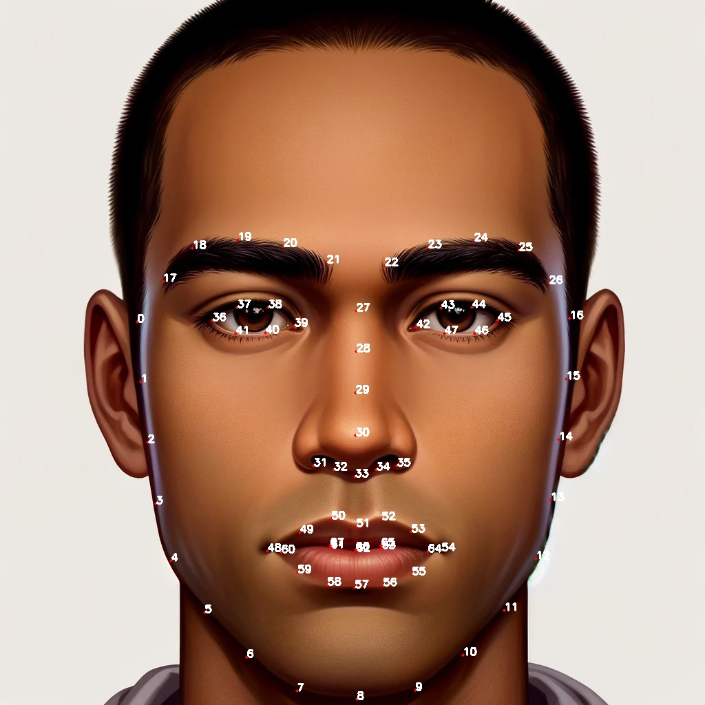
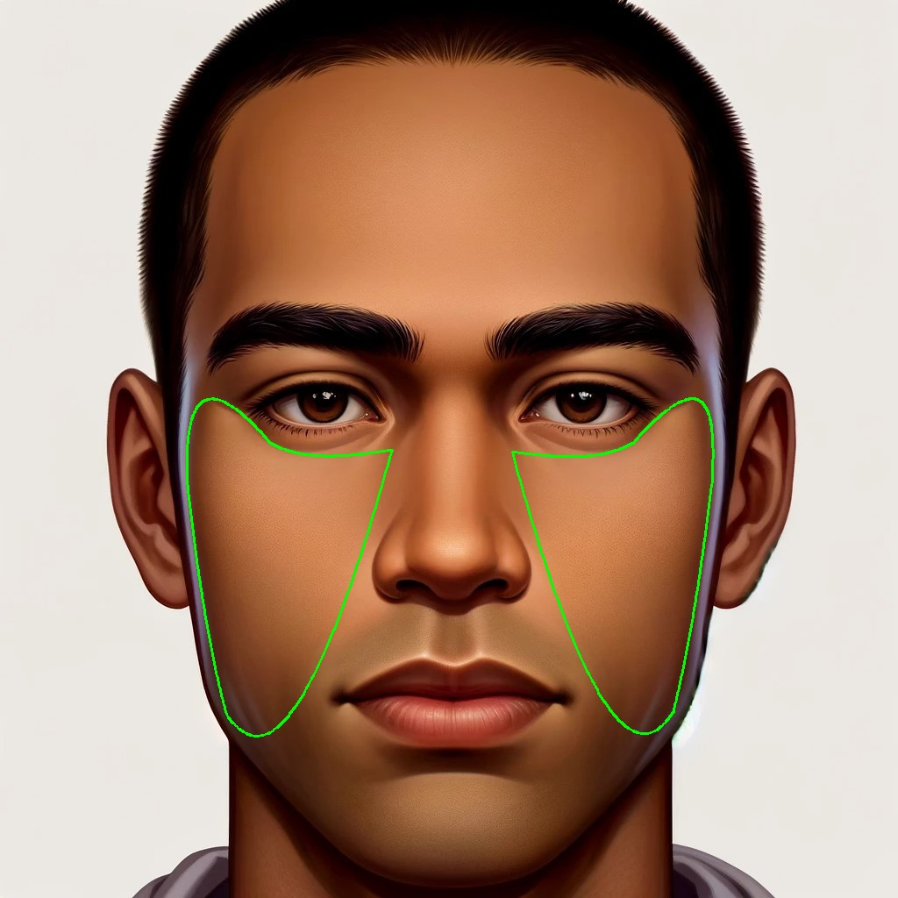

# Py68FaceZones (Facial Feature Marking and Transformation Tool)

This tool uses the `dlib` and `OpenCV` (cv2) libraries to process faces in images, automatically detect facial features, and draw feature points and Bezier curves on the face. Additionally, the program can apply features from one cheek area to the other.

## Features

- Automatically detect faces in images.
- Draw 68 feature points on detected faces.
- Draw Bezier curves on specified cheek areas.
- Apply features from one cheek to the other.

## Installation Requirements

- python3.8
- opencv-python==4.8.1.78
- cmake==3.27.7
- wheel
- boost==0.1
- dlib==19.24.2
- imutils==0.5.4

## File Structure

- `shape_predictor_68_face_landmarks.dat`: dlib facial feature predictor file.
- `res/`: Directory for storing original images.
- `res/result/`: Directory for storing processed images.

## Usage Instructions

1. Ensure all dependencies are installed, and the `shape_predictor_68_face_landmarks.dat` file is in the project root directory.
2. Place the images to be processed in the `res/` directory.
3. Run the `main()` function. You can modify the `file_name` variable to specify the image file to be processed (excluding the file extension).
4. The processed images will be saved in the `res/result/` directory.

## Error Handling

- If the `shape_predictor_68_face_landmarks.dat` file does not exist or the image files in the `res/` directory are missing, the program will throw an error.
- If no faces are detected in the image, the program will also report an error.