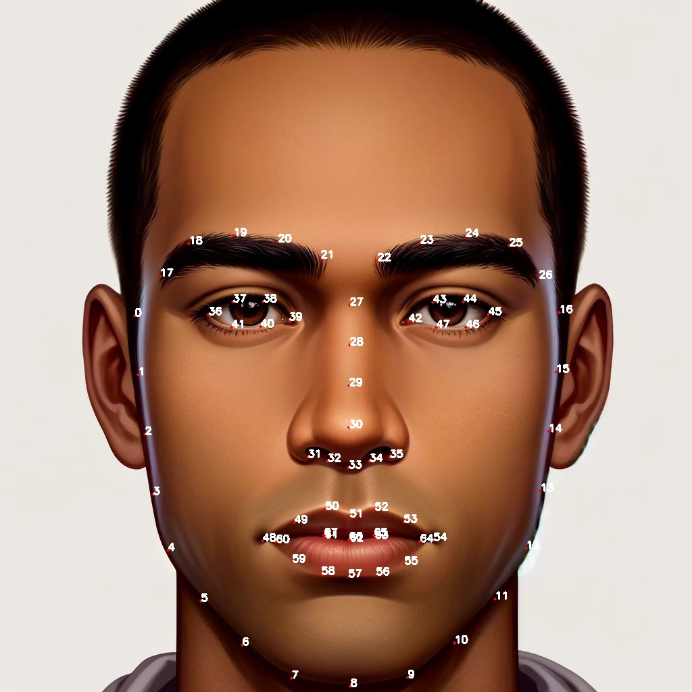
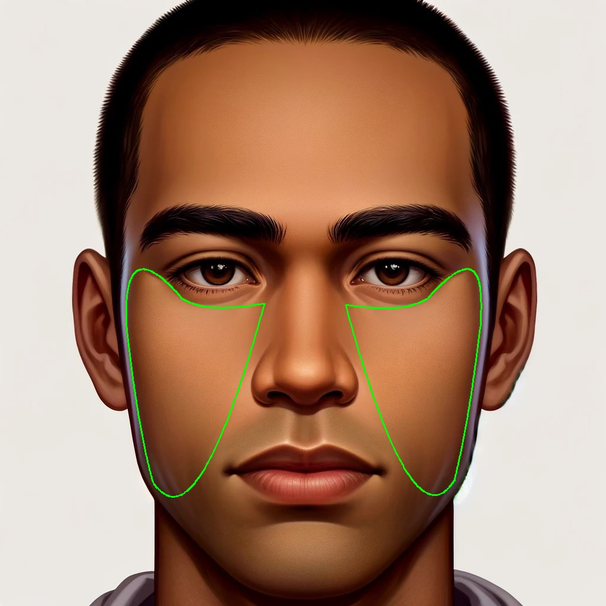
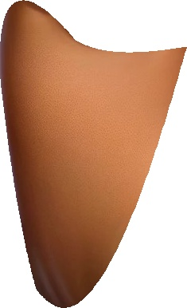
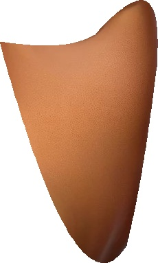

# Py68FaceZones

[中文](README.zh-TW.md)

## Overview

Py68FaceZones uses `dlib` and `OpenCV` (`cv2`) to process face images, detect 68 facial landmarks, draw custom cheek-region Bezier paths, and export cropped cheek areas.




## Features

- Automatically detects faces in an image.
- Draws all 68 dlib facial landmarks with index labels.
- Builds left and right cheek regions from facial landmarks using Bezier curves.
- Exports cropped cheek-region images for both sides of the face.

## Requirements

- Python 3.12
- `numpy<2`
- `opencv-python==4.8.1.78`
- `dlib-bin==19.24.2.post1`
- `imutils==0.5.4`

Install the dependencies with:

```bash
python -m pip install -r requirements.txt
```

## File Structure

- `shape_predictor_68_face_landmarks.dat`: dlib 68-point facial landmark predictor file.
- `res/`: Directory for input images.
- `res/result/`: Directory for generated output images.

## Usage

1. Make sure all dependencies are installed and place `shape_predictor_68_face_landmarks.dat` in the project root.
2. Put the input image in the `res/` directory.
3. Edit the `file_name` variable in `main.py` to specify the input filename without the extension. For example, `file_name = "test"` reads `res/test.jpg`.
4. Run the program:

```bash
python main.py
```

5. The generated images will be saved in `res/result/`.

## Output Images

After execution, the following output files are generated in `res/result/`:

- `test_landmarks.jpg`: The original face image with all 68 landmark points and their indices drawn on top. This is useful for verifying that face detection and landmark localization are working correctly.
- `test_full.jpg`: The original image with green Bezier curve outlines showing the left and right cheek regions.
- `test_left_zone.jpg`: The cropped left cheek region defined by the custom path. Pixels outside the selected region are filled with white.
- `test_right_zone.jpg`: The cropped right cheek region defined by the custom path, using the same extraction logic as the left side.

## Example Outputs

### Landmark Detection


### Cheek Region Paths


### Extracted Left Cheek



### Extracted Right Cheek



## Error Handling

- If `shape_predictor_68_face_landmarks.dat` is missing, or the specified image does not exist in `res/`, the program will raise an error.
- If no face is detected in the image, the program will report an error.
